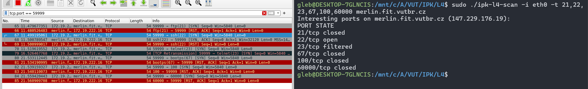
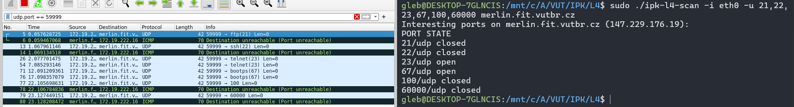

# IPK PROJECT 2

## Table of Contents

1. [Introduction](#l4-scanner)
2. [Requirements](#requirements)
3. [Execution](#execution)
   - [Arguments](#program-arguments)
4. [Code](#code)
5. [Testing](#testing)
6. [Limitations](#limitations)
   - [Interfaces](#interfaces)
   - [UDP](#udp)
   - [IPV6](#ipv6)
   - [Memory](#memory)
7. [Bibliography](#bibliography)

---

### L4 Scanner

**ipk-l4-scan** is an application to scan ports on a specific network interface for a specific hostname or IP address. It can use both TCP and UDP scanning. (see section [Bibliography](#bibliography) for more information)

Each scanned port could have **open | closed | filtered** states for TCP scanning and **open | closed** states for UDP scanning 


## Requirements

In order to compile program you need to install pcap library

For Debian/Ubuntu:
```
sudo apt-get install libpcap-dev
```


## Execution
```
sudo ./ipk-l4-scan [-i interface | --interface interface] [--pu port-ranges | --pt port-ranges | -u port-ranges | -t port-ranges] {-w timeout} [domain-name | ip-address]
```


#### Program arguments

| Argument                        | Description                                                                                                   |
|--------------------------------|---------------------------------------------------------------------------------------------------------------|
| `-i` or  `--interface`                  | Specifies the network interface to scan through. If not specified, prints a list of active interfaces.       |
| `--pt port-ranges`              | Specifies TCP port ranges to scan. E.g., `--pt 22`, `--pt 1-65535`, `--pt 22,23,24`.                         |
| `--pu port-ranges`              | Specifies UDP port ranges to scan. E.g., `--pu 22`, `--pu 1-65535`, `--pu 22,23,24`.                         |
| `-w` or `--wait`      | Specifies the timeout in milliseconds to wait for a response for a single port scan. Default is 5000 ms.      |
| `domain-name` or `ip-address`   | Specifies either a fully qualified domain name or IP address of the scanned device.                          |

## Code

After the program is launched, argument parsing takes place, with optional error output. If the *-i* option is not specified, the program will also print all available network interfaces. Next, the *pcap* handle is initialized, along with the network socket, and variables are filled with data necessary for the program to work. Then a loop begins, which processes each port specified by the user, sending a packet to the specific port, and then the program waits for a response using `select()`. (`select()` is used because the internal timeout function of the *pcap* library does not work on all platforms, and any value specified in it will not be read). Then, depending on the result of *select()*, the program chooses what message to print (including using the `handle_response()` function) (and whether to output anything at all in the case of TCP). After completing this loop, a similar loop follows for the UDP protocol, which differs in some aspects, such as: different output formats, adding `sleep(1)` to avoid exceeding the ICMP message limit, which can send a maximum of 80 messages in 4 seconds (This parameter is taken with a large margin, as there were problems even with a value of 0.8 seconds). Then the program terminates by releasing all resources.


## Testing

Both TCP and UDP variant were tested. Testing was on merlin.fit.vutbr.cz server.
The expected results are similar to the actual results

TCP testing:


UDP testing:



## Limitations

##### Interfaces

The application was developed under link-type `LINKTYPE_ETHERNET`, so functionality of other interfaces is not guaranteed

##### UDP

Due to unreliability of UDP protocol, some ports on the scanned host may mistakenly appear open when in reality they are closed. This is because some hosts do not send an icmp packet to lighten the load on the servers. 

##### IPV6

IPV6 has only been tested on the loopback interface, so there is no guarantee that ipv6 will be fully functional on other interfaces

##### Memory

When scanning a large number of ports, the program may allocate a relatively large number of bytes. Specifically, when scanning all available ports (1-65535) the program allocates 2110 MB of memory


## Bibliography
* RFC 793 - Transmission Control Protocol
* RFC 791 - Internet Protocol
* RFC 768 - User Datagram Protocol
* Port scanner - http://en.wikipedia.org/wiki/Port_scanner
* SYN scanning - https://nmap.org/book/synscan.html
* UDP scanning - http://nmap.org/nmap_doc.html#port_unreach
* RFC 8200 - Internet Protocol, Version 6 (IPv6) Specification
* RFC 2553 - Basic Socket Interface Extensions for IPv6
* IPv6 book https://knihy.nic.cz/files/edice/IPv6-2019.pdf